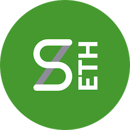

# Synth sETH (sETH) Token

## Overview

**Synth sETH (sETH)** is a standard ERC20 utility token deployed on the Ethereum blockchain. It operates with a fixed, unchangeable total supply, ensuring no new tokens can ever be created.

The primary use case of sETH is to function as a liquid asset within the decentralized finance (DeFi) ecosystem. Its value is established and maintained through its trading pair with Wrapped Ether (WETH) on decentralized exchanges like Uniswap. This mechanism allows sETH to serve as a straightforward and transparent representation of Ethereum's value, suitable for various DeFi applications and trading strategies.
- **Token Name:** Synth sETH  
- **Symbol:** sETH  
- **Type:** ERC20  
- **Decimals:** 18  
- **Contract Address:** [0xf119ada773624761108a12bc20503b2195727061](https://etherscan.io/token/0xf119ada773624761108a12bc20503b2195727061)  
- **Chain ID:** 1 (Ethereum Mainnet)   

1) Vision: To provide a foundational, no-frills utility token that enhances liquidity and composability in the Ethereum DeFi space.

Problem: The DeFi landscape is often populated with complex tokenomic models involving taxes, rebasing, or inflationary mechanisms. While innovative, these can create barriers to entry and unpredictability for users and developers. There is a persistent need for simple, standard assets that act as reliable building blocks for trading and protocol integration.

Solution: sETH addresses this by being a standard, fixed-supply ERC20 token. Its simplicity is its core feature. By avoiding complex on-chain logic, it ensures predictability, low gas overhead for transfers, and seamless integration with all standard DeFi protocols and wallets.
2) Tokenomics & Distribution
The sETH tokenomic model is designed for long-term sustainability and community-focused growth. The allocation is transparent and serves distinct purposes within the ecosystem.

90% - Community & Ecosystem Growth (90,000,000 sETH): This majority share is allocated for strategic growth, including over-the-counter (OTC) sales to partners, marketing campaigns, and funding for future development as decided by the community.
5% - Initial Liquidity (5,000,000 sETH): A portion of the supply used to create the initial WETH/sETH trading pair on Uniswap, enabling public market access from day one.
5% - Team & Development (5,000,000 sETH): Allocated to the founding team, subject to a vesting schedule to ensure long-term commitment to the project's success.
3) Roadmap
The project roadmap is divided into three strategic phases, focusing on building a strong foundation, growing visibility, and expanding the ecosystem.

Phase 1 (Q3 2025): Focus on core infrastructure, including contract deployment, initial liquidity, and establishing an official web and social presence.
Phase 2 (Q4 2025): Emphasis on building trust and visibility through liquidity locking and applications to major data aggregators like CoinGecko and CoinMarketCap.
Phase 3 (2026): Exploration of ecosystem expansion, including potential cross-chain functionality and integrations with other DeFi platforms.

---

## Website

(https://www.syntheth.com/)

---

## Explorer

(https://etherscan.io/token/0xf119ada773624761108a12bc20503b2195727061)

---

## Socials

- [Twitter](https://twitter.com/syntheth)  
- [GitHub](https://github.com/synthsethdev/synthseth)

---

## Tags

`synthetic`, `erc20`

